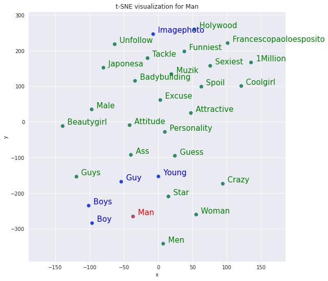
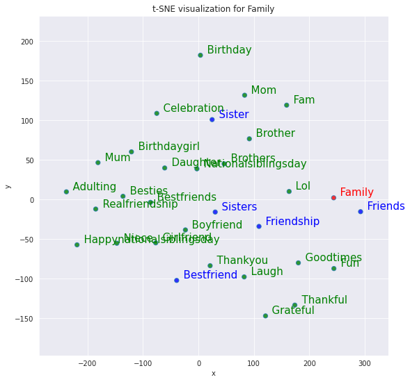
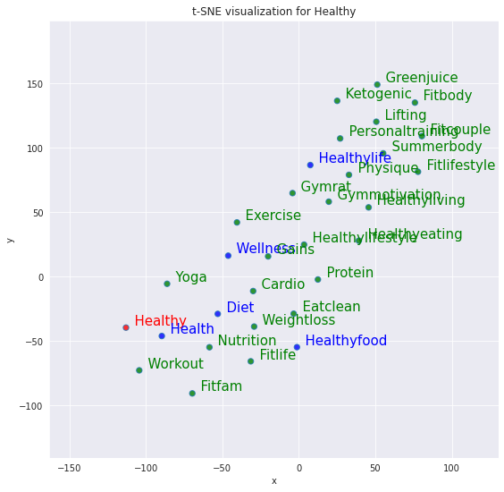
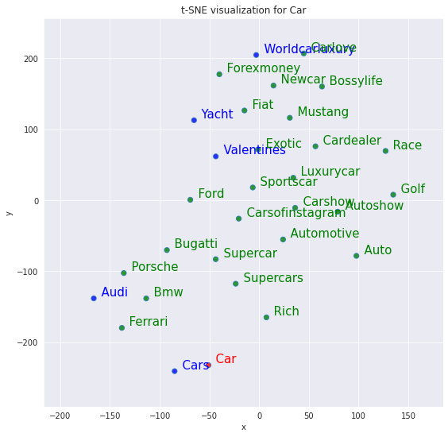
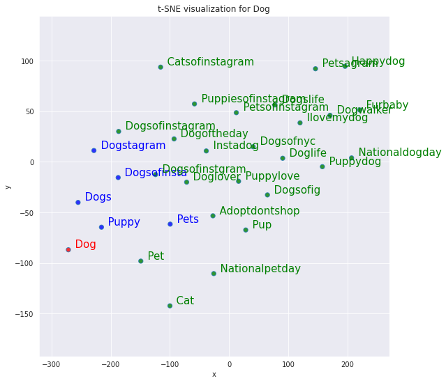
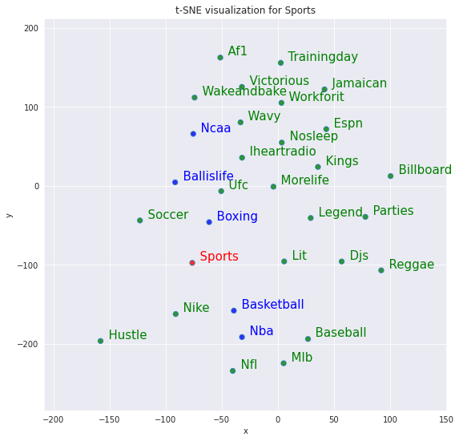
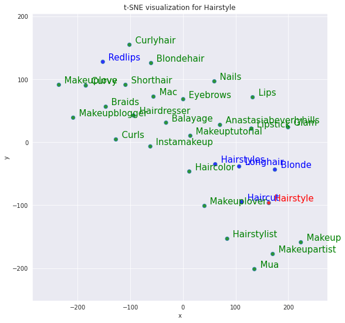
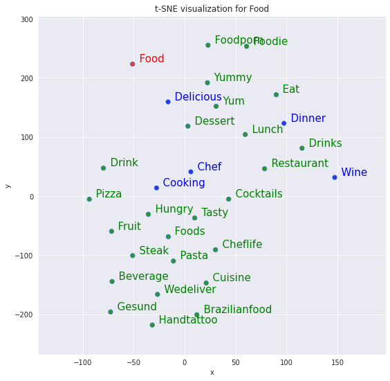
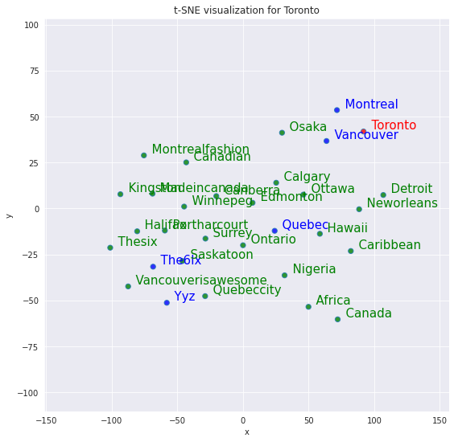

# Multimodal Image Retrieval

[](https://github.com/koushikvikram/multimodal-image-retrieval/actions/workflows/pylint.yml)  [](https://github.com/koushikvikram/multimodal-image-retrieval/actions/workflows/pytest.yml)

> 🚦⚠️👷‍♂️🏗️ Repo Under Construction 🚦⚠️👷‍♂️🏗️

A deep learning application to retrieve images by searching with text

## Dataset

Download the InstaNY100K dataset from this [Google Drive link](https://drive.google.com/file/d/1blGgEOlrHrM0-NAQxYVRwMlfiHDvVHXb/view?usp=sharing)

Extract the dataset in the path, `./datasets/raw/`. You folder structure should look like the one below:

```
./datasets/raw/
|
|-- InstaNY100K
    |
    |-- captions
    |   |
    |   |-- newyork
    |      | 1487768220566960691.txt
    |      | 1490727714071958379.txt
    |      | ...
    |   
    |-- img_resized
        |
        |-- newyork
            | 1480879485913200243.jpg
            | 1480879539524935620.jpg
            | ...
```


## GitHub Actions for this Repository

[Pylint - Code Quality Check](https://github.com/koushikvikram/multimodal-image-retrieval/actions/workflows/pylint.yml)

[Pytest - Functionality and Behavioral Tests for Classes and Models](https://github.com/koushikvikram/multimodal-image-retrieval/actions/workflows/pytest.yml)

## Exploring the Word2Vec Model

<p align="middle">
  
   
  
  
  
  
  
  
  
</p>

## Acknowledgment

Articles used as reference during development are documented in the [references](https://github.com/koushikvikram/multimodal-image-retrieval/tree/main/references) directory.

If you run into issues while testing the platform, please create an issue on this GitHub repository at the following link and I'll be glad to fix it: https://github.com/koushikvikram/multimodal-image-retrieval/issues

If you'd like to collaborate with me or hire me, please feel free to send an email to koushikvikram91@gmail.com

Make sure to check out other repositories on my [homepage](https://github.com/koushikvikram).