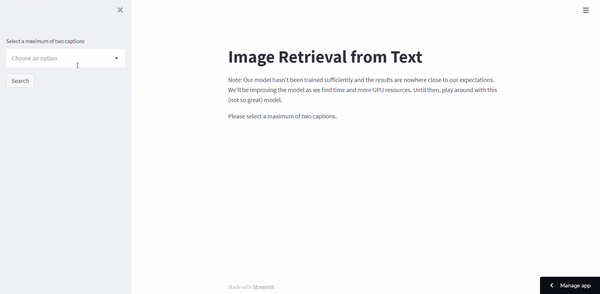
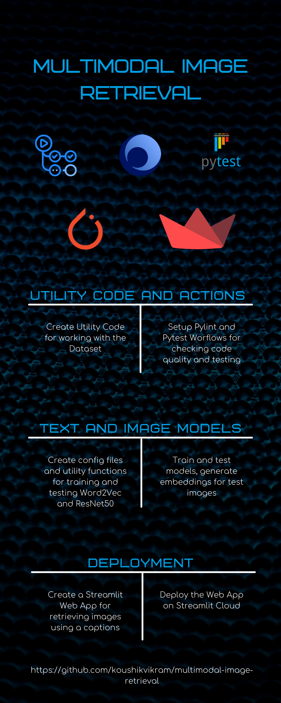

# Multimodal Image Retrieval

[](https://github.com/koushikvikram/multimodal-image-retrieval/actions/workflows/pylint.yml)  [](https://github.com/koushikvikram/multimodal-image-retrieval/actions/workflows/pytest.yml) [](https://share.streamlit.io/koushikvikram/multimodal-image-retrieval/main/app.py)
[](https://github.com/koushikvikram)
[](https://www.linkedin.com/in/koushikvikram/)



> 🚦⚠️👷‍♂️🏗️🚦⚠️👷‍♂️🏗️🚦⚠️👷‍♂️🏗️ Repo Under Construction 🚦⚠️👷‍♂️🏗️🚦⚠️👷‍♂️🏗️🚦⚠️👷‍♂️🏗️ 

> Note: Our model hasn't been trained sufficiently and the results are nowhere close to our expectations. We'll be improving the model as we find time and more GPU resources. Until then, play around with this (not so great) model.  
> Things we're looking to try:
> - Improve preprocessing
>   - Replace special characters with space
> - Play around with embedding dimensions
> - Use the entire InstaNY100K Dataset
> - Train Word2Vec again
> - Use different CNNs for regressing Word2Vec embeddings from images.
> - Try different post-processing strategies for embeddings.
> - Train with MSELoss
> - Experiment with other distance functions

A deep learning application to retrieve images by searching with text. 

Try out the application here: https://share.streamlit.io/koushikvikram/multimodal-image-retrieval/main/app.py

## Project Workflow



## Dataset

Download the InstaNY100K dataset from this [Google Drive link](https://drive.google.com/file/d/1blGgEOlrHrM0-NAQxYVRwMlfiHDvVHXb/view?usp=sharing)

Extract the dataset in the path, `./datasets/raw/`. You folder structure should look like the one below:

```
./datasets/raw/
|
|-- InstaNY100K
    |
    |-- captions
    |   |
    |   |-- newyork
    |      | 1487768220566960691.txt
    |      | 1490727714071958379.txt
    |      | ...
    |   
    |-- img_resized
        |
        |-- newyork
            | 1480879485913200243.jpg
            | 1480879539524935620.jpg
            | ...
```


## GitHub Actions for this Repository

[Pylint - Code Quality Check](https://github.com/koushikvikram/multimodal-image-retrieval/actions/workflows/pylint.yml)

[Pytest - Functionality and Behavioral Tests for Classes and Models](https://github.com/koushikvikram/multimodal-image-retrieval/actions/workflows/pytest.yml)

## Exploring the Word2Vec Model

We recommend using the [TensorFlow Embedding Projector](http://projector.tensorflow.org/) to visualize our Word2Vec model.

Load the [tensor](https://github.com/koushikvikram/multimodal-image-retrieval/blob/main/model/word2vec_viz_tensor.tsv) and [metadata](https://github.com/koushikvikram/multimodal-image-retrieval/blob/main/model/word2vec_viz_metadata.tsv) tsv files provided in the model directory and visualize words that interest you!

Samples from TensorFlow Embedding Projector:

<p align="middle">
  
  
  
</p>

You can also use [models/explore_word2vec.ipynb](https://github.com/koushikvikram/multimodal-image-retrieval/blob/main/model/explore_word2vec.ipynb) to explore words of interest.

Samples from the Jupyter Notebook:

<p align="middle">
  
   
  
  
  
  
  
  
  
</p>

## Acknowledgment

Articles used as reference during development are documented in the [references](https://github.com/koushikvikram/multimodal-image-retrieval/tree/main/references) directory.

If you run into issues while using the repo, please create an issue on this GitHub repository at the following link and I'll be glad to fix it: https://github.com/koushikvikram/multimodal-image-retrieval/issues

If you'd like to collaborate with me or hire me, please feel free to send an email to koushikvikram91@gmail.com

Make sure to check out other repositories on my [homepage](https://github.com/koushikvikram).